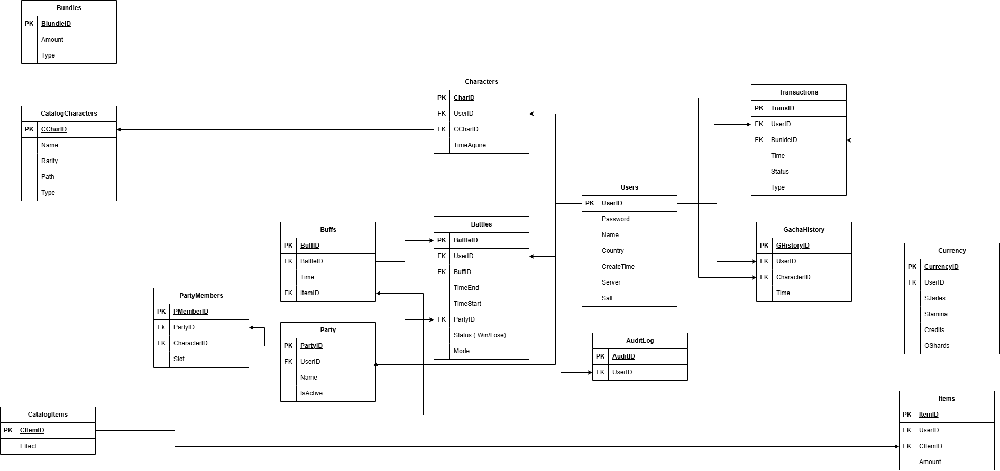

# Online Star Rail

An educational client-server online game that simulates real online game infrastructure, exploring network security, authentication, and data engineering. Inspired by Honkai: Star Rail.

## System Architecture

The system is split into three independently deployed components: a C++ game client, a C++ game server, and a Python authentication server, all backed by PostgreSQL.

```
┌──────────────┐         TLS / Protobuf          ┌──────────────────┐
│  C++ Client  │ ◄──────────────────────────────► │   C++ Game       │
│  (this repo) │         port 9000                │   Server         │
└──────────────┘                                  └────────┬─────────┘
                                                           │
                                                           │  libpqxx
                                                           ▼
                                                  ┌──────────────────┐
                                                  │   PostgreSQL     │
                                                  │   Database       │
                                                  └──────────────────┘
                                                           ▲
                                                           │  psycopg2
                                                           │
┌──────────────┐        HTTPS / JSON              ┌──────────────────┐
│  C++ Client  │ ◄──────────────────────────────► │  Python Auth     │
│  (token auth)│        port 8443                 │  Server (FastAPI)│
└──────────────┘                                  └──────────────────┘
```

## Client (this repository)

A C++ CLI application that connects to the game server over TLS and provides a menu-driven interface for all game features.

### Features

- **Authentication** — Login, sign up, and automatic session resumption via locally saved JWT tokens
- **Shop** — Browse and purchase Oneiric Shard bundles with pricing tiers and bonus amounts
- **Daily Rewards** — Claim daily login rewards
- **Character List** — View owned characters
- **Wish / Gacha** — Pull for new characters using the gacha system
- **Party** — Manage team compositions (in progress)
- **Bag** — View inventory (in progress)

### Design

- **Command Pattern** — The menu system uses an abstract `Command` base class with `CallbackCommand` (wraps `std::function`) and `ExitCommand` implementations, allowing features to be registered dynamically
- **ConnectManager** — Manages the TLS socket lifecycle and serializes all requests into length-prefixed Protobuf `ClientMessage` envelopes
- **SSLContext / Socket** — Low-level OpenSSL wrapper for TLS client connections
- **Session persistence** — Access tokens are saved to `.osr_session` and restored on startup to skip re-authentication

### Client Source Files

| File | Purpose |
|---|---|
| `Online_Star_Rail.cpp` | Entry point, authentication flow, menu setup |
| `connect_manager.cpp/h` | TLS connection and Protobuf message sending |
| `socket.cpp/h` | Raw TCP + TLS socket wrapper |
| `ssl.cpp/h` | OpenSSL context management |
| `menu.cpp/h` | Command Pattern menu display and dispatch |
| `command.cpp/h` | `Command`, `CallbackCommand`, `ExitCommand` classes |
| `shop.cpp/h` | Shop UI and purchase flow |
| `daily_rewards.cpp/h` | Daily reward claim interface |
| `character_list.cpp/h` | Character roster display |
| `characters.cpp/h` | Character data structures |
| `auth.cpp/h` | Authentication helpers |
| `data.cpp/h` | Shared data definitions |
| `protobuf.cpp` | Protobuf serialization/deserialization helpers |
| `game.proto` | Protocol Buffer message definitions |

## Game Server

A multi-threaded C++ game server built with CMake, using Asio for async networking.

| Component | Description |
|---|---|
| `NetworkServer` / `Session` | Asio-based async TLS server on port 9000. Accepts connections, performs TLS handshake, and reads length-prefixed Protobuf messages. Multi-threaded with a configurable thread pool. |
| `MessageHandler` | Routes deserialized `ClientMessage` to the appropriate handler (login, signup, token auth, wish pull, shop, game action). Enforces authentication before game actions. |
| `Database` | PostgreSQL connection manager using libpqxx. Supports prepared statements, transactions with automatic rollback, and INI-file-based configuration. |
| `UserAuth` | Handles user registration and login. Passwords are hashed with SHA-256 + salt, then derived via PBKDF2-HMAC-SHA256 (100k iterations). Uses constant-time comparison to prevent timing attacks. |
| `JWTVerifier` | Verifies RS256-signed JWT access tokens using the auth server's public key. Parses claims and checks expiration. |
| `Server` (PIMPL) | Top-level orchestrator that initializes the database, auth, message handler, and network server. Supports graceful shutdown via signal handling (SIGINT/SIGTERM). |

## Auth Server

A Python FastAPI service that handles authentication over HTTPS (port 8443).

| Endpoint | Description |
|---|---|
| `POST /register` | Create account, hash password, initialize currency, return JWT + refresh token |
| `POST /login` | Verify credentials, issue RS256 JWT access token (15 min) + refresh token (7 day) |
| `POST /refresh` | Rotate refresh token, issue new access token |
| `POST /logout` | Revoke all refresh tokens for the user |
| `GET /verify` | Validate a Bearer token and return claims |

Password hashing mirrors the C++ server's scheme (SHA-256 + PBKDF2-HMAC-SHA256, 100k iterations) for compatibility. Refresh tokens are database-backed with rotation and revocation support.

## Tech Stack

| Layer | Technology |
|---|---|
| Client | C++17, Makefile, raw TCP sockets + OpenSSL |
| Game Server | C++17, CMake, Asio (standalone) + OpenSSL |
| Auth Server | Python 3, FastAPI, Uvicorn, PyJWT |
| Serialization | Protocol Buffers 3 (protobuf) |
| Database | PostgreSQL 14+, libpqxx (C++), psycopg2 (Python) |
| Authentication | JWT RS256 (asymmetric), PBKDF2-HMAC-SHA256 |
| Transport Security | TLS 1.2 (both client-server and auth server) |
| Extensions | pgcrypto, uuid-ossp |

## Protocol

Client and server communicate using length-prefixed Protocol Buffer messages over TLS:

```
[4-byte big-endian length][protobuf payload]
```

All requests are wrapped in a `ClientMessage` envelope with a `oneof payload` field:

| MessageType | Payload | Description |
|---|---|---|
| `LOGIN` | `LoginRequest` | Username + password authentication |
| `SIGNUP` | `SignupRequest` | New account registration |
| `TOKEN_AUTH` | `TokenAuthRequest` | JWT session resumption |
| `GAME_ACTION` | `GameActionRequest` | In-game choices (user_id, choice, scenario_id) |
| `WISH_PULL` | `WishPullRequest` | Gacha pulls (user_id, pull_count) |
| `SHOP` | `ShopRequest` | Item purchases (user_id, item_id, quantity) |

The server responds with a `ServerResponse` containing success status, message, user ID, and optionally an access token.

## Database Design

The PostgreSQL schema consists of 14 tables covering users, game content, economy, battles, and auditing.



### Tables

| Table | Purpose |
|---|---|
| **Users** | Core accounts with salted/hashed passwords, UUID, country, server |
| **Currency** | Per-user balances: Stellar Jades, Stamina, Credits, Oneiric Shards |
| **CatalogCharacters** | Character templates with rarity (Common–Mythic), path, and type |
| **CatalogItems** | Item definitions with effect descriptions |
| **Characters** | Player-owned character instances (references catalog + user) |
| **Items** | Player-owned item instances with quantities |
| **Bundles** | Purchasable bundles with pricing |
| **Transactions** | Purchase records with status tracking (Pending/Completed/Failed/Refunded) |
| **GachaHistory** | Tracks every character pull per user |
| **Party** | Named team compositions per user |
| **PartyMembers** | Character slots (1–4) within a party |
| **Battles** | Battle sessions with mode, status, party, and buff references |
| **Buffs** | In-battle item-based buffs |
| **AuditLog** | Security audit trail for sensitive operations |

### Database Security

- **Audit triggers** on `Users` and `Currency` tables automatically log changes
- **Security views** (`PublicUsers`, `UserInventorySummary`) expose data without sensitive fields
- **CHECK constraints** enforce valid currency amounts, party slot ranges, and transaction statuses
- **Limited-privilege** `osr_app` database user for application access
- **pgcrypto** and **uuid-ossp** extensions for cryptographic functions and UUID generation

## Security

| Layer | Measures |
|---|---|
| Network | TLS 1.2 encryption on all connections |
| Passwords | SHA-256 + PBKDF2-HMAC-SHA256 (100,000 iterations), per-user salt, constant-time comparison |
| Tokens | RS256 JWT access tokens (15 min TTL), database-backed refresh tokens with rotation |
| Database | Parameterized queries (SQL injection prevention), audit triggers, row-level data masking |
| Sessions | Per-client authentication state enforcement, message-level authorization |
